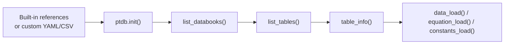
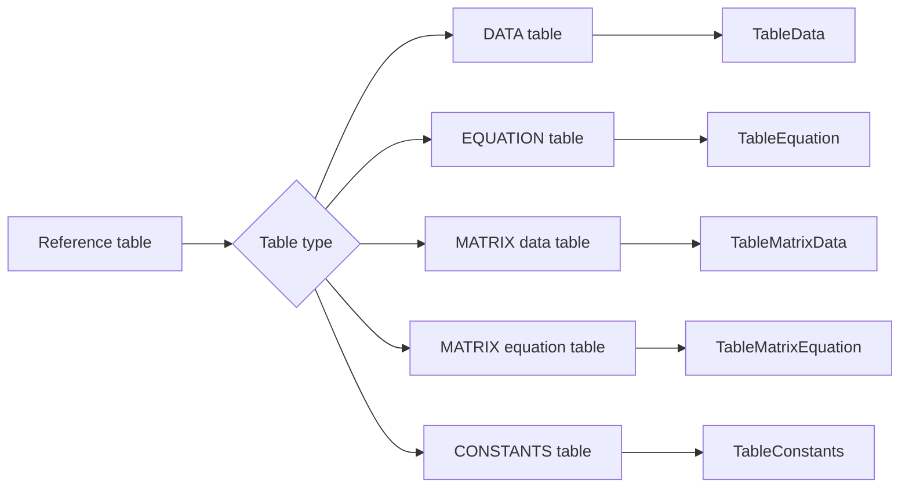
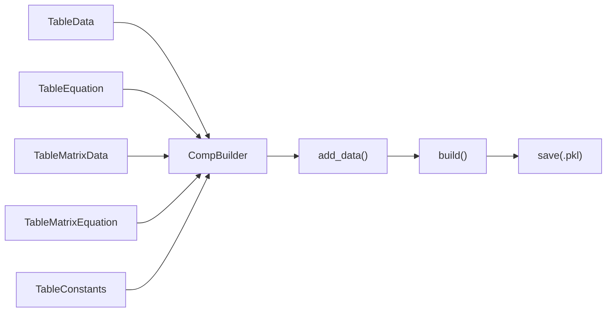
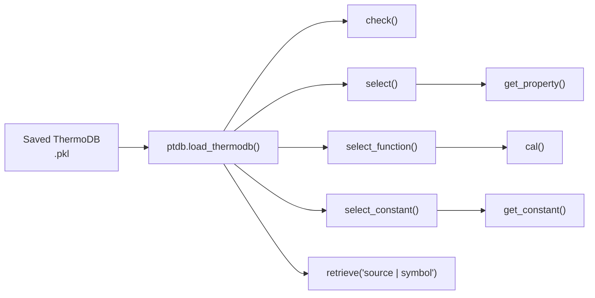
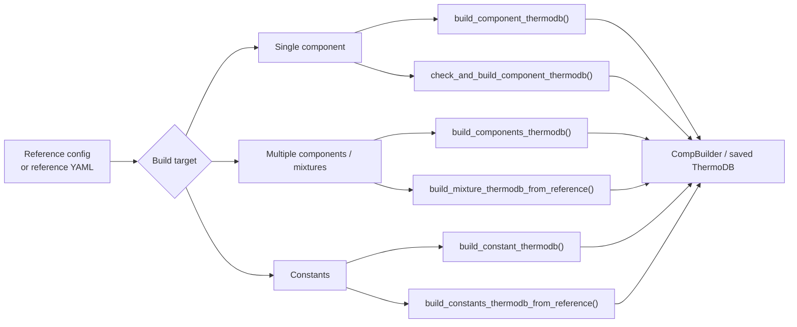

# 🧪 Python Thermodynamics Databook


[](https://pepy.tech/projects/pythermodb)


PyThermoDB is a lightweight and user-friendly Python package designed to provide quick access to essential thermodynamic data. Whether you're a student, researcher, or engineer, this package serves as a valuable resource for retrieving thermodynamic properties, equations, and constants from your `custom thermodynamic database` (csv files).

## ✨ Key Features:

- 📚 **Handbook Data**: The package sources its data from well-established thermodynamics handbooks, ensuring accuracy and reliability (*updated regularly*).
- 🔧 **Custom Thermodynamic Database**: It is possible to builtin your own thermodynamic databook for your project.
- 🧩 **Minimal Dependencies**: Built with simplicity in mind, the package has minimal external dependencies, making it easy to integrate into your projects.
- 🌐 **Open Source**: Feel free to explore, contribute, and customize the package according to your needs.

## 🔄 PyThermoDB Functional Workflow

PyThermoDB is organized around a simple workflow: initialize a reference, inspect databooks and tables, build typed thermodynamic objects, package them into a reusable ThermoDB, and reload the saved ThermoDB in applications.

### 📝 1. Reference and table discovery



This first layer helps users explore the available thermodynamic source data before building objects. It supports built-in references and custom project references.

### 🧩 2. Core object builders



The `pyThermoDB/core` folder defines the typed objects used by the package:

- 📊 `TableData`: component property records and `get_property()`.
- 🧮 `TableEquation`: component equations with `cal()`, derivatives, integrals, and custom integrals.
- 🧱 `TableMatrixData`: matrix-style data for mixtures and pairwise parameters.
- 🔢 `TableMatrixEquation`: matrix equations for mixture calculations.
- 🧪 `TableConstants`: table-wide constants and `get_constant()`.

### 🏗️ 3. Build ThermoDB packages



`CompBuilder` packages selected properties, equations, matrix data, matrix equations, and constants into one reusable ThermoDB artifact.

### 🚀 4. Load and use in applications



After loading a ThermoDB, application code can retrieve component properties, evaluate equations, access constants, and use compact source strings such as `general | MW` or `custom-constants | R`.

### 📚 5. Higher-level reference builders



These higher-level builders automate the same core workflow shown above. They are useful when users want to build complete ThermoDB files directly from reference configuration instead of manually loading each table.

## 🤖 PyThermoAI

[PyThermoAI](https://github.com/sinagilassi/PyThermoAI) is an intelligent Python package that revolutionizes thermodynamic data acquisition and processing by leveraging advanced AI agents and web search capabilities.

Built with LangGraph for creating sophisticated multi-agent workflows, PyThermoAI employs intelligent agents to collect thermodynamic data and equations. The system utilizes Tavily as its primary web search engine, enabling agents to efficiently discover and retrieve thermodynamic data from authoritative online sources. These agents can search for thermodynamic data and automatically convert the results into PyThermoDB reference formats, streamlining the process of building and updating your custom thermodynamic database.


## 📓 Interactive Notebooks with Binder

Try PyThermoDB directly in your browser without any installation using Binder. You can find examples regarding the following contents:

- **Import Libraries**: Import the necessary libraries including pyThermoDB and rich.
- **Check Versions**: Print the version of pyThermoDB.
- **App Initialization**: Initialize the pyThermoDB application.
- **Databook List**: List all available databooks.
- **Table List**: List all tables in a specific databook.
- **Table Info**: Get information about a specific table.
- **Load Tables**: Load and display data and equations from tables.
- **Check Component Availability**: Check if a component is available in a specific table.
- **Build Data**: Build data for a specific component from a table.
- **Build Equation**: Build an equation for a specific component from a table.

Click on any of the following links to launch interactive Jupyter notebooks:

* [Basic Usage 1](https://mybinder.org/v2/gh/sinagilassi/PyThermoDB/HEAD?urlpath=%2Fdoc%2Ftree%2Fnotebooks%2Fdoc1.ipynb)
* [Custom Reference](https://mybinder.org/v2/gh/sinagilassi/PyThermoDB/HEAD?urlpath=%2Fdoc%2Ftree%2Fnotebooks%2Fref-external.ipynb)
* [Check Reference](https://mybinder.org/v2/gh/sinagilassi/PyThermoDB/HEAD?urlpath=%2Fdoc%2Ftree%2Fnotebooks%2Ftable-view.ipynb)

## 🛠️ Examples

The repository includes an `examples` folder with various sample applications and use cases to help you get started with PyThermoDB. These examples demonstrate different methods and features of the package, including:

- 🧰 **Basic Usage Examples**: Learn how to use PyThermoDB for common tasks.
- 📂 **Custom Thermodynamic Databases**: Work with your own thermodynamic data.
- 🔍 **Data Manipulation**: Load, search, and manipulate thermodynamic data.
- 📐 **Equations and Calculations**: Use equations for thermodynamic calculations.

Browse through these examples to learn how to use different methods and features of PyThermoDB in your own projects.

## 🔬 Google Colab Examples

Try PyThermoDB directly in your browser with these interactive examples:

- 🔍 **Search Database**
  [](https://colab.research.google.com/drive/1y5GIE4DH73SwOF2JhsTug2_U_h9Fqexx?usp=sharing)

- 📊 **CO₂ Thermodynamic Data**
  [](https://colab.research.google.com/drive/1mzu70kACdvoB_jO6gTGVegGtK_ssOOHq?usp=sharing)

- 🔎 **Check Component Availability**
  [](https://colab.research.google.com/drive/1HdGHS_uypEf_yzsq7fZyLZH3dWnjYVSg?usp=sharing)

- 📘 **Basic Usage 2**
  [](https://colab.research.google.com/drive/1vj84afCy0qKfHZzQdvLiJRiVstiCX0so?usp=sharing)

- 🔰 **Basic Usage 1**
  [](https://colab.research.google.com/drive/1jWkaSJ280AZFn9t8X7_bqz_pYtY2QKbr?usp=sharing)

## 📥 Installation

Install PyThermoDB with pip:

```python
import pyThermoDB as ptdb
# check version
print(ptdb.__version__)
```

## 🔍 Search a Component Name or Formula

PyThermoDB allows you to search for a specific component by its name or formula within a databook and table. This feature helps you quickly locate the relevant data and makes it easier to build a ThermoDB for the component.


## 🛠️ Usage Examples

* **Databook reference initialization**:

```python
# databook reference initialization
tdb = ptdb.init()
```

* **📚 DATABOOK LIST**:

```python
# databook
db_list = tdb.list_databooks()
print(db_list)
```

* **📋 TABLE LIST**:

list_tables(`databook_name or databook_id`)

```python
# table list
tb_lists = tdb.list_tables(1)
print(tb_lists)
```

* **ℹ️ TABLE INFO**:

table_info(`databook_name or id`, `table_name or id`)

```python
# display a table
tb_info = tdb.table_info(1, 2)
print(tb_info)
```

* **📊 LOAD TABLE DATA/EQUATION**:

table_data(`databook_name or id`, `table_name or id`)

```python
# table load
res_ = tdb.table_data(1, 2)
print(res_)
```

* **🌐 VIEW TABLE CONTENT IN THE BROWSER**


table_view(`databook_name or id`, `table_name or id`)

```python
# install Jinja2
pip install Jinja2

# VIEW table CONTENT
tdb.table_view(1, 2)
```

* **📥 LOAD TABLES DATA|EQUATION STRUCTURE** (before building):

equation_load(`databook_name or id`, `table_name or id`)

```python
# load equation to check
vapor_pressure_tb = tdb.equation_load(1, 4)
print(vapor_pressure_tb.eq_structure(1))
# load data to check
data_table = tdb.data_load(1, 2)
print(data_table.data_structure())
```

* **🔍 CHECK COMPONENT AVAILABILITY IN A TABLE**:

get_component_data(`component name`, `databook_name or id`, `table_name or id`, ...)

```python
# check component availability in the databook and table
comp1 = "carbon Dioxide"

# method 1
# CO2_check_availability = tdb.check_component(comp1, 1, 2)

# method 2:
comp_data = tdb.get_component_data(comp1, 1, 2, dataframe=True)
print(comp_data)
```

* **🏗️ BUILD DATA OBJECT**:

build_data(`component name`, `databook_name or id`, `table_name or id`)

```python
# build data
CO2_data = tdb.build_data(comp1, 1, 2)
print(CO2_data.data_structure())
print(CO2_data.get_property(4))
```

* **BUILD TABLE-WIDE CONSTANTS OBJECT**:

Constants tables are not component-specific and use their own loader.

```python
constants = tdb.constants_load('CUSTOM-REF-1', 'Custom-Constants')
print(constants.data_structure())
print(constants.get_constant('R'))

constants = tdb.build_constants('CUSTOM-REF-1', 'Custom-Constants')
```

* **📐 BUILD EQUATION OBJECT**:

build_equation(`component name`, `databook_name or id`, `table_name or id`)

```python
# build an equation
eq = tdb.build_equation(comp1, 1, 4)
print(eq.args)
res = eq.cal(T=298.15)
print(res*1e-5)
```

## 🧱 Build ThermoDB for Components

DataTable & EquationTable saved as an object in `Carbon Dioxide.pkl`

* **🔨 BUILD THERMODB**:

```python
# build a thermodb
thermo_db = ptdb.build_thermodb()
print(type(thermo_db))

# version
print(thermo_db.build_version)

# thermodb name
print(thermo_db.thermodb_name)

# * add TableData
thermo_db.add_data('general', comp1_data)
# * add TableEquation
thermo_db.add_data('heat-capacity', comp1_eq)
thermo_db.add_data('vapor-pressure', vapor_pressure_eq)
# add string
# thermo_db.add_data('dHf', {'dHf_IG': 152})
# file name
# thermodb_file_path = os.path.join(os.getcwd(), f'{comp1}')
# save
thermo_db.save(
    f'{comp1}', file_path='..\\pyThermoDB\\tests')
```

* **🔍 CHECK THERMODB**:

```python
# check all properties and functions registered
print(thermo_db.check_properties())
print(thermo_db.check_functions())
```

## 📂 Load a ThermoDB

`Carbon Dioxide.pkl` can be loaded as:

* **📤 LOAD THERMODB FILE**:

```python
# ref
thermodb_file = 'Carbon Dioxide.pkl'
thermodb_path = os.path.join(os.getcwd(), thermodb_file)
print(thermodb_path)
```

* **📥 LOAD THERMODB**:

```python
# load thermodb
CO2_thermodb = ptdb.load_thermodb(thermodb_path)
print(type(CO2_thermodb))
```

* **✅ CHECK THERMODB**:

```python
# check all properties and functions registered
print(CO2_thermodb.check())
```

## 🧮 Custom Integral

* **Step 1**:

  Modify `yml file` by adding `CUSTOM-INTEGRAL`.

* **Step 2**:

  Add a name for the new integral body.

* **Step 3**:

  Add a list containing the integral body.

```yml
CUSTOM-INTEGRAL:
    Cp/R:
        - A1 = parms['a0']*args['T1']
        - B1 = (parms['a1']/2)*(args['T1']**2)
        - C1 = (parms['a2']/3)*(args['T1']**3)
        - D1 = (parms['a3']/4)*(args['T1']**4)
        - E1 = (parms['a4']/5)*(args['T1']**5)
        - res1 =  A1 + B1 + C1 + D1 + E1
        - A2 = parms['a0']*args['T2']
        - B2 = (parms['a1']/2)*(args['T2']**2)
        - C2 = (parms['a2']/3)*(args['T2']**3)
        - D2 = (parms['a3']/4)*(args['T2']**4)
        - E2 = (parms['a4']/5)*(args['T2']**5)
        - res2 =  A2 + B2 + C2 + D2 + E2
        - res = res2 - res1
```

* **🔬 CHECK AS**:

```python
# check custom integral
print(comp1_eq.custom_integral)
# check body
print(comp1_eq.check_custom_integral_equation_body('Cp/R'))

# Cp/R
Cp_cal_custom_integral_Cp__R = comp1_eq.cal_custom_integral(
    'Cp/R', T1=298.15, T2=320)
print(Cp_cal_custom_integral_Cp__R)
```

## 📚 Custom Databook & Table

PyThermoDB allows you to define and use custom databooks and tables for your specific thermodynamic data needs. Here's how you can set up and use a custom databook and table:

* **📝 Define Custom Reference**

Check `csv` and `yml` files to be familiar with the right format!

```python
# Define custom reference
custom_ref = {
  'reference': ['nrtl.yml'],
  'tables': [
    'Non-randomness parameters of the NRTL equation.csv',
    'Interaction parameters of the NRTL equation.csv'
  ]
}
```

* **📋 List Tables in Databook**

```python
# List tables in databook
tb_lists = tdb.list_tables('NRTL', res_format='json')
print(tb_lists)
```

* **📂 Load Table Data**

table_data(`databook_name or id`, `table_name or id`)

```python
# Load table data
tb_data = tdb.table_data(7, 1)
print(tb_data)
```

* **🏗️ Build ThermoDB for the Custom Reference**

```python
# Build ThermoDB
thermo_db = ptdb.build_thermodb()
thermo_db.add_data('nrtl_alpha', nrtl_alpha)
thermo_db.add_data('nrtl_tau', nrtl_tau_eq)
thermo_db.save('thermodb_nrtl_0', file_path='notebooks')
```

## 📝 License

This project is licensed under the MIT License. You are free to use, modify, and distribute this software in your own applications or projects. However, if you choose to use this app in another app or software, please ensure that my name, Sina Gilassi, remains credited as the original author. This includes retaining any references to the original repository or documentation where applicable. By doing so, you help acknowledge the effort and time invested in creating this project.

The MIT License applies solely to the source code contained in this repository. This project does NOT distribute, sublicense, or grant any rights to third-party thermodynamic data. Any thermodynamic data used with this software must be obtained independently by the user from its original source and used in accordance with the applicable license or terms of use.

## ❓ FAQ

For any question, contact me on [LinkedIn](https://www.linkedin.com/in/sina-gilassi/)


## 👨‍💻 Authors

- [@sinagilassi](https://www.github.com/sinagilassi)
