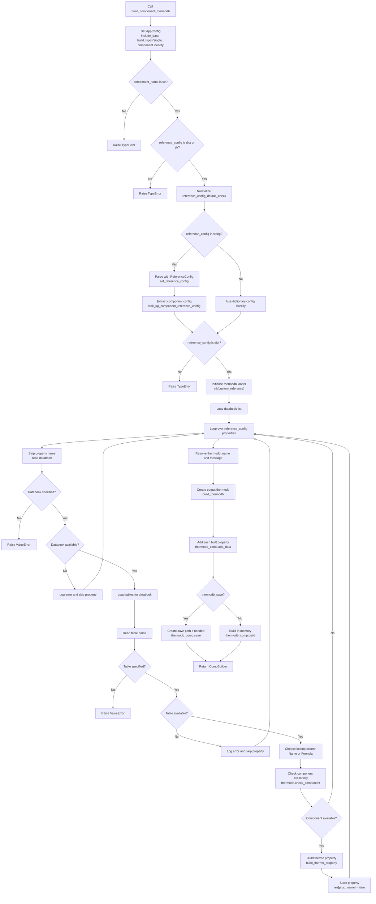

# `build_component_thermodb`

`build_component_thermodb` builds a single-component thermodynamic database from an explicit reference configuration. The caller provides the component identifier, the databook/table mapping for each desired property, and optionally a custom reference source. The method checks the requested databooks, tables, and component availability before creating property objects and adding them to a `CompBuilder` thermodb.

This builder identifies a component by either:

- `Name`
- `Formula`

It does not use component state. For state-aware matching with a `Component` model, use `check_and_build_component_thermodb`.

## Main Inputs

| Argument | Purpose |
| --- | --- |
| `component_name` | Component name or formula to build, depending on `component_key`. |
| `reference_config` | Property-to-source mapping as a dictionary, or YAML/string config that can be parsed by `ReferenceConfig`. |
| `custom_reference` | Optional reference source passed to `init(custom_reference=...)`. |
| `component_key` | Selects the lookup column: `Name` or `Formula`. |
| `thermodb_name` | Optional output thermodb name. Defaults to `component_name`. |
| `message` | Optional thermodb description. Defaults to a generated property list message. |
| `reference_config_default_check` | Controls default lookup behavior when `reference_config` is supplied as a string. |
| `thermodb_save` | Saves the built thermodb to disk when `True`; otherwise builds it in memory. |
| `thermodb_save_path` | Optional directory used when saving. Defaults to the current working directory. |
| `include_data` | Sets global build configuration for whether source data is included. |

## Reference Config Shape

`reference_config` is the build recipe for the component thermodb. It tells `build_component_thermodb` which thermodynamic properties should be included and which source table should be used for each property.

The method needs this argument because a reference can contain many databooks and many tables. For example, one custom reference may contain general component constants, vapor-pressure equations, ideal-gas heat-capacity equations, liquid-density data, and mixture tables. `build_component_thermodb` does not automatically guess which of those tables belong in the final component thermodb. Instead, `reference_config` defines the selected subset.

Each top-level property key becomes the name used later in the returned `CompBuilder`. For example, if the config contains `heat-capacity`, `vapor-pressure`, and `general`, the returned thermodb can be queried with those names:

```python
func1 = thermodb_component_.select_function('heat-capacity')
func2 = thermodb_component_.select_function('vapor-pressure')
general = thermodb_component_.select('general')
```

Each property entry points to the source location:

- `databook`: the databook name registered in `pyThermoDB`.
- `table`: the table inside that databook.

During the build, the method uses this mapping to:

1. check that the databook exists,
2. check that the table exists inside that databook,
3. check that `component_name` is available in that table,
4. build a property object from the selected source table,
5. add the property object to the output thermodb under the config property name.

When `reference_config` is already a dictionary, each key is the thermodb property name and each value must provide a `databook` and `table`.

```python
reference_config = {
    'heat-capacity': {
        'databook': 'CUSTOM-REF-1',
        'table': 'Ideal-Gas-Molar-Heat-Capacity',
    },
    'vapor-pressure': {
        'databook': 'CUSTOM-REF-1',
        'table': 'vapor-pressure',
    },
    'general': {
        'databook': 'CUSTOM-REF-1',
        'table': 'general-data',
    },
}
```

In this dictionary form, the config is already the selected property recipe. The method loops over this dictionary directly and does not look for a nested component key.

When `reference_config` is a string, the method treats it as a larger component-aware config. It first converts the string with `ReferenceConfig().set_reference_config(...)`, then extracts the configuration for `component_name` with `look_up_component_reference_config(...)`.

```yaml
ALL:
  heat-capacity:
    databook: CUSTOM-REF-1
    table: Ideal-Gas-Molar-Heat-Capacity
  vapor-pressure:
    databook: CUSTOM-REF-1
    table: vapor-pressure
carbon dioxide:
  heat-capacity:
    databook: CUSTOM-REF-1
    table: Ideal-Gas-Molar-Heat-Capacity
  general:
    databook: CUSTOM-REF-1
    table: general-data
CO2:
  vapor-pressure:
    databook: CUSTOM-REF-1
    table: vapor-pressure
```

For a string config, lookup is case-insensitive. If a matching key for `component_name` is found, that component-specific section is used. If no component-specific section is found and `reference_config_default_check=True`, the method falls back to a default key such as `ALL` when one is available. If no matching or default config exists, the method raises `ValueError`.

This means the same string config can support multiple call styles:

```python
thermodb_by_name = ptdb.build_component_thermodb(
    component_name='carbon dioxide',
    reference_config=reference_config_yml,
    custom_reference=ref,
    component_key='Name',
)

thermodb_by_formula = ptdb.build_component_thermodb(
    component_name='CO2',
    reference_config=reference_config_yml,
    custom_reference=ref,
    component_key='Formula',
)
```

The extracted property recipe is then processed exactly like the dictionary form.

## Returned Object

The method returns a `CompBuilder` object.

The returned thermodb contains one entry for each successfully built property. Each entry is created by `thermodb.build_thermo_property(...)`, so the property object can be a table-data or equation-backed thermo property depending on the selected source table.

Unlike `check_and_build_component_thermodb`, this method does not wrap the result in `ComponentThermoDB` and does not return reference metadata.

## Processing Flow

1. Store an `AppConfig` with `include_data`, build type, and either component name or formula.
2. Validate `component_name` and `reference_config`.
3. If `reference_config` is a string, parse it and extract the component-specific property configuration.
4. Initialize the runtime thermodb loader with `init(custom_reference=custom_reference)`.
5. Load available databooks from the initialized thermodb.
6. Iterate through each requested property in `reference_config`.
7. For each property:
   - read the target `databook` and `table`,
   - skip missing databooks or tables,
   - choose the lookup column from `component_key`,
   - check component availability in the selected table,
   - build the thermo property when the component is available.
8. Create a new output thermodb with `build_thermodb`.
9. Add every successfully built property object to the output thermodb.
10. Save the thermodb if `thermodb_save=True`; otherwise call `build()`.
11. Return the built `CompBuilder`.

## Diagram



## Component Matching

`component_key` controls which table column is used during the availability check and property build:

- `Name`: matches `component_name` against the table `Name` column.
- `Formula`: matches `component_name` against the table `Formula` column.

For example, `component_name='carbon dioxide'` should use `component_key='Name'`, while `component_name='CO2'` should use `component_key='Formula'`.

## Save Behavior

When `thermodb_save=False`, the method calls `thermodb_comp.build()` and returns the in-memory `CompBuilder`.

When `thermodb_save=True`, the method saves the thermodb using:

- `filename=thermodb_name`
- `file_path=thermodb_save_path`, or the current working directory when no path is provided

If `thermodb_save_path` is provided and the directory does not exist, it is created before saving.

## Important Notes

- Missing databooks, missing tables, and unavailable components are skipped for that property.
- Missing `databook` or `table` keys raise `ValueError`.
- The method can return a thermodb even if no property was successfully added; in that case `build()` may log a warning.
- String `reference_config` inputs are component-aware because they are passed through `look_up_component_reference_config`.
- The default message lists the requested config keys, not only the properties that were successfully built.
