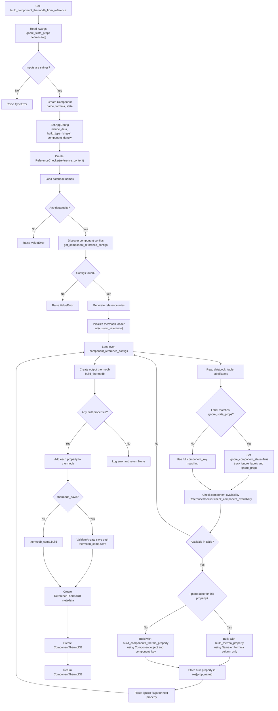

# `build_component_thermodb_from_reference`

`build_component_thermodb_from_reference` builds a single-component thermodynamic database directly from reference content. The reference content is expected to be a YAML string or a reference path accepted by `ReferenceChecker`; it must define one or more databooks and tables with component records.

The method searches the reference for a component identified by:

- `component_name`
- `component_formula`
- `component_state`

It then discovers all matching non-constants tables, builds thermodynamic property objects for the available tables, inserts them into a `CompBuilder` thermodb, and returns a `ComponentThermoDB` object that keeps both the built thermodb and the reference metadata used to build it.

## Main Inputs

| Argument | Purpose |
| --- | --- |
| `component_name` | Component name used for matching, for example `carbon dioxide`. |
| `component_formula` | Component formula used for matching, for example `CO2`. |
| `component_state` | Component state used for matching, for example `g` or `l`. |
| `reference_content` | YAML reference content, or reference input accepted by `ReferenceChecker`. |
| `component_key` | Selects whether matching uses `Name + State` or `Formula + State`. |
| `add_label` | Includes table labels/symbols in generated reference configs. |
| `check_labels` | Validates labels/symbols against the known symbol registry. |
| `thermodb_save` | Saves the thermodb to disk instead of only building it in memory. |
| `include_data` | Sets global build configuration for whether source data is included. |
| `ignore_state_props` | Optional keyword-only list of labels/properties whose state should be ignored during matching and building. |

## Returned Object

The method returns `ComponentThermoDB | None`.

When successful, the returned `ComponentThermoDB` contains:

- `component`: a `Component` model containing the requested name, formula, and state.
- `thermodb`: the built `CompBuilder` thermodb.
- `reference_thermodb`: a `ReferenceThermoDB` model containing:
  - original reference content,
  - discovered component configs,
  - generated reference rules,
  - labels used by the selected tables,
  - labels/properties whose state matching was ignored.

The method returns `None` when reference configs are found but no valid property can be built from them.

## Processing Flow

1. Validate `component_name`, `component_formula`, and `component_state`.
2. Create a `Component` object.
3. Store an `AppConfig` with `include_data`, build type, and component identity through `set_config`.
4. Create `ReferenceChecker(reference_content)` and load databook names.
5. Ask `ReferenceChecker.get_component_reference_configs(...)` to find matching component table configs across all databooks.
6. Generate reference rules from the discovered configs with `generate_component_reference_rules`.
7. Initialize the runtime thermodb loader with `init(custom_reference={'reference': [reference_content]})`.
8. Iterate through every discovered property/table config:
   - collect labels from `label` or `labels`,
   - decide whether this property should ignore component state,
   - re-check component availability in the selected databook/table,
   - build a thermo property object.
9. Create a new thermodb with `build_thermodb`.
10. Add every successfully built property to the thermodb.
11. Either save the thermodb or call `build()`.
12. Wrap the result in `ComponentThermoDB` and return it.

## Diagram

## State-Ignoring Behavior

By default, the component is matched using `component_key`:

- `Name-State`: compares `Name` and `State`.
- `Formula-State`: compares `Formula` and `State`.

When `ignore_state_props` is provided, each discovered label is checked against that list. If a label matches, the method temporarily ignores state for that property only. In that case, the property is built with `build_thermo_property` using either the `Name` column or the `Formula` column. Otherwise, it builds with `build_components_thermo_property` using the full `Component` object.

The method records ignored labels in `reference_thermodb.ignore_labels` and ignored property names in `reference_thermodb.ignore_props`.

## Important Notes

- Constants tables are filtered out during reference config discovery.
- Matching is delegated to `ReferenceChecker`, which performs case-insensitive, stripped comparisons.
- If `check_labels=True`, labels/symbols from tables must be recognized by `SymbolController`.
- The default thermodb name is `component_name`.
- The default message lists all discovered reference config keys, not only properties that were successfully built.
