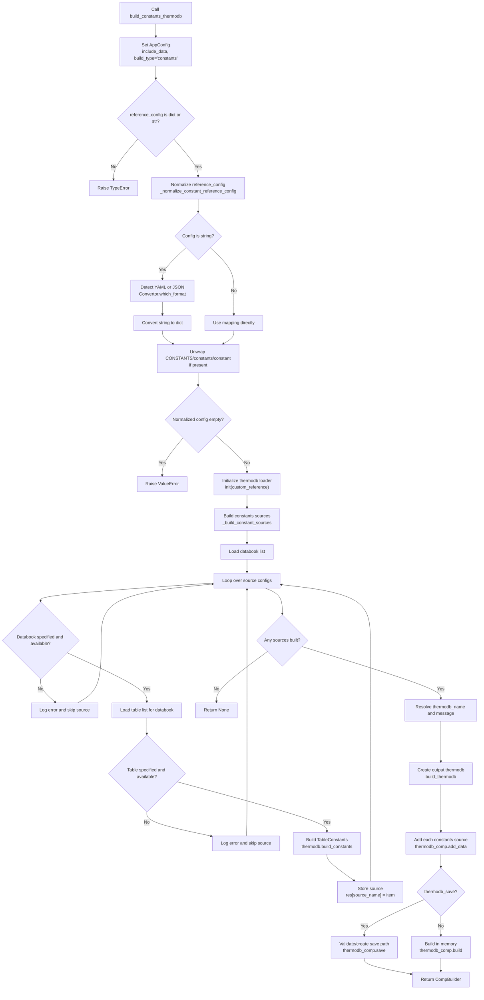

# `build_constants_thermodb`

`build_constants_thermodb` builds a thermodb that contains table-wide constants. It uses an explicit constants `reference_config` to decide which constants tables should be loaded from the available references, builds each selected table as a `TableConstants` source, and stores those sources in a returned `CompBuilder`.

This method is for constants tables, not component property tables. A constants table is accessed later by source name, then by constant identifier.

## Main Inputs

| Argument | Purpose |
| --- | --- |
| `reference_config` | Constants source mapping as a dictionary, YAML string, or JSON string. |
| `custom_reference` | Optional custom reference source passed to `init(custom_reference=...)`. |
| `thermodb_name` | Optional output thermodb name. Defaults to `constants`. |
| `message` | Optional thermodb description. Defaults to a generated source-list message. |
| `reference_config_default_check` | Kept for API parity with other builders; constants configs are treated as direct source configs. |
| `thermodb_save` | Saves the built thermodb to disk when `True`; otherwise builds it in memory. |
| `thermodb_save_path` | Optional directory used when saving. |
| `include_data` | Sets global build configuration for whether source data is included. |
| `verbose` | Enables detailed build logging and elapsed-time logging. |

## Reference Config

`reference_config` is the build recipe for constants sources. Each top-level key becomes the source name in the returned `CompBuilder`, and each source points to one constants table.

The required source fields are:

- `databook`: databook name registered in the initialized pyThermoDB reference.
- `table`: constants table name inside that databook.

Optional fields such as `mode`, `label`, `symbol`, `labels`, or `symbols` can be included for clarity or compatibility with generated configs. In `build_constants_thermodb`, those label fields are not used to filter constants; the whole constants table is built as a `TableConstants` source.

```python
reference_config = {
    'custom-1': {
        'databook': 'CUSTOM-REF-1',
        'table': 'Custom-Constants',
        'mode': 'CONSTANTS',
        'labels': {
            'Universal Gas Constant': 'R',
            'enthalpy of reaction': 'dH_rxn',
            'binary parameter': 'Xb',
            'custom constants': 'X',
        },
    },
    'custom-2': {
        'databook': 'CUSTOM-REF-1',
        'table': 'Custom-Constants-2',
        'mode': 'CONSTANTS',
        'labels': {
            'Universal Gas Constant': 'R',
            'enthalpy of reaction': 'dG_rxn',
        },
    },
}
```

With this config, the returned thermodb contains constants sources named `custom-1` and `custom-2`.

## String Configs

`reference_config` may also be a YAML or JSON string. The method normalizes string configs with `_normalize_constant_reference_config(...)`.

String configs may define constants sources directly:

```yaml
custom-1:
  databook: CUSTOM-REF-1
  table: Custom-Constants
  mode: CONSTANTS
  labels:
    Universal Gas Constant: R
```

Or they may wrap sources under one of these keys:

- `CONSTANTS`
- `constants`
- `constant`

```yaml
CONSTANTS:
  custom-1:
    databook: CUSTOM-REF-1
    table: Custom-Constants
    mode: CONSTANTS
  custom-2:
    databook: CUSTOM-REF-1
    table: Custom-Constants-2
    mode: CONSTANTS
```

After normalization, the method always works with a dictionary shaped as:

```python
{
    source_name: {
        'databook': databook_name,
        'table': table_name,
        ...
    }
}
```

## What Gets Built

For each configured source, the method checks:

1. the `databook` field exists,
2. the databook is available,
3. the `table` field exists,
4. the table is available in that databook.

Then it calls:

```python
thermodb.build_constants(
    databook=databook_,
    table=table_
)
```

The result is a `TableConstants` object. That object is stored in the output `CompBuilder` under the configured source name:

```python
thermodb_comp.add_data(source_name, source_value)
```

If a source is missing its databook or table, or if the databook/table cannot be found, that source is skipped. If no constants source is built, the method returns `None`.

## Returned Object

The method returns `Optional[CompBuilder]`.

When successful, the returned `CompBuilder` contains one or more `TableConstants` sources:

```python
thermodb_constants_ = ptdb.build_constants_thermodb(
    reference_config=reference_config,
    custom_reference=ref,
    thermodb_name='custom-constants-reference-1',
)
```

Constants can then be accessed by selecting a constants source:

```python
custom_1 = thermodb_constants_.select_constant('custom-1')
R = custom_1.get_constant('R', message='gas constant')
```

Or by using the `CompBuilder.retrieve(...)` helper:

```python
R = thermodb_constants_.retrieve(
    'custom-1 | R',
    message='gas constant'
)
```

The source name before the pipe, such as `custom-1`, comes from the top-level key in `reference_config`. The constant identifier after the pipe, such as `R`, comes from the constants table content.

## Processing Flow

1. Store an `AppConfig` with `include_data` and `build_type='constants'`.
2. Validate that `reference_config` is a dictionary or string.
3. Normalize the constants config with `_normalize_constant_reference_config(...)`.
4. Initialize the thermodb loader with `init(custom_reference=custom_reference)`.
5. Build constants sources with `_build_constant_sources(...)`.
6. Return `None` if no constants sources were built.
7. Resolve `thermodb_name` and `message`.
8. Create the output thermodb with `build_thermodb(...)`.
9. Add each `TableConstants` source to the output thermodb.
10. Save the thermodb if `thermodb_save=True`; otherwise call `build()`.
11. Return the built `CompBuilder`.

## Diagram



## Save and Load

When `thermodb_save=False`, the method calls `thermodb_comp.build()` and returns the in-memory thermodb.

When `thermodb_save=True`, the method validates or creates `thermodb_save_path`, then saves the thermodb using:

- `filename=thermodb_name`
- `file_path=thermodb_save_path`

The saved thermodb can be loaded later:

```python
thermodb_loaded = ptdb.load_thermodb(thermodb_path)
const1 = thermodb_loaded.select_constant('custom-1')
R = const1.get_constant('R', message='loaded gas constant')
```

## Difference From `check_and_build_constant_thermodb`

`build_constants_thermodb` performs source-level checks for databook and table availability, then builds the constants table.

`check_and_build_constant_thermodb` performs additional validation:

- verifies that the table type is `Constants`,
- checks requested constants when `constants` is provided,
- checks configured labels/symbols when present.

Use `build_constants_thermodb` when the config already points to known constants tables. Use `check_and_build_constant_thermodb` when the config needs stronger validation before building.

## Important Notes

- The returned object is a `CompBuilder`, not a `ConstantsThermoDB` wrapper.
- Each top-level config key becomes a constants source name in the returned thermodb.
- Each built source is a `TableConstants` object.
- The method builds complete constants tables; it does not filter the table by `labels`.
- Missing or unavailable sources are skipped.
- The method returns `None` when no constants source is built.
- The default thermodb name is `constants`.
