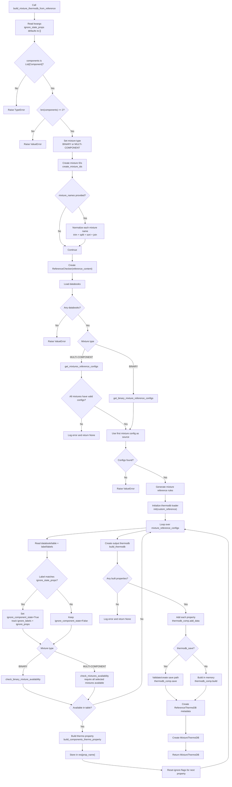

# `build_mixture_thermodb_from_reference`

`build_mixture_thermodb_from_reference` builds a mixture thermodynamic database directly from reference content. It accepts a list of `Component` objects, discovers matrix-compatible mixture property tables in the reference, builds thermo property objects for the discovered tables, and returns a `MixtureThermoDB` wrapper with both the built thermodb and reference metadata.

This method supports:

- binary mixtures (`len(components) == 2`)
- multi-component mixtures (`len(components) > 2`), using all binary combinations or explicit `mixture_names`

## Main Inputs

| Argument | Purpose |
| --- | --- |
| `components` | List of `Component` models used for matching and building. At least two components are required. |
| `reference_content` | YAML reference content, or reference input accepted by `ReferenceChecker`. |
| `component_key` | Component matching key inside each mixture row: `Name-State` or `Formula-State`. |
| `mixture_key` | Mixture identity basis: `Name` or `Formula`. |
| `mixture_names` | Optional explicit mixture IDs for multi-component filtering. |
| `column_name` | Column containing mixture identity in matrix tables (default: `Mixture`). |
| `delimiter` | Delimiter used in mixture IDs (default: `&#124;`). |
| `add_label` | Includes table labels/symbols in generated reference configs. |
| `check_labels` | Validates labels/symbols against the symbol registry. |
| `thermodb_save` | Saves the built thermodb to disk instead of only building in memory. |
| `ignore_state_props` | Optional keyword-only list of labels/properties whose state should be ignored during matching/building. |

## Returned Object

The method returns `MixtureThermoDB | None`.

When successful, `MixtureThermoDB` contains:

- `components`: input component list.
- `thermodb`: the built `CompBuilder` thermodb.
- `reference_thermodb`: a `ReferenceThermoDB` model containing:
  - original reference content,
  - discovered mixture configs,
  - generated reference rules,
  - labels seen in selected tables,
  - labels/properties that used state-ignored matching.

The method returns `None` when discovery succeeds but no property can be built and added.

## Processing Flow

1. Validate `components` type/content and require at least two components.
2. Detect mixture type (`BINARY` or `MULTI-COMPONENT`).
3. Build sorted mixture IDs using `create_mixture_ids`.
4. If `mixture_names` is provided, normalize each ID by trimming parts and sorting by delimiter.
5. Create `ReferenceChecker(reference_content)` and load databooks.
6. Discover reference configs with `get_binary_mixture_reference_configs(...)` for binary mode, or `get_mixtures_reference_configs(...)` for multi-component mode.
7. Generate mixture rules with `generate_mixture_reference_rules(...)`.
8. Initialize runtime thermodb with `init(custom_reference={'reference': [reference_content]})`.
9. Iterate over each discovered property/table config, collect labels, apply optional state-ignore logic, verify mixture availability, and build thermo property with `build_components_thermo_property(...)`.
10. Create output thermodb with `build_thermodb(...)`.
11. Add all successfully built properties.
12. Save (`save`) or finalize in memory (`build`).
13. Wrap result in `MixtureThermoDB` and return.

## Diagram

## State-Ignoring Behavior

Default matching uses state-aware keys through `component_key`:

- `Name-State`
- `Formula-State`

When `ignore_state_props` is provided, every discovered table label is checked with `ignore_state_in_prop(...)`. If a label matches, the method temporarily sets `ignore_component_state=True` for that property availability/build pass only.

Ignored labels and properties are recorded in:

- `reference_thermodb.ignore_labels`
- `reference_thermodb.ignore_props`

## Functions Used By This Workflow

### `create_mixture_ids`

- File: `pyThermoDB/utils/component_utils.py`
- Purpose: create sorted unique binary mixture IDs from all component pairs.
- Key behavior:
  - uses `Name` or `Formula` based on `mixture_key`,
  - sorts pair members before joining (order-insensitive IDs),
  - returns IDs like `methanol|ethanol`.

### `ignore_state_in_prop`

- File: `pyThermoDB/utils/prop_utils.py`
- Purpose: case-insensitive check of whether a property/label should ignore component state.
- Key behavior:
  - returns `False` for `None` or empty list,
  - lowercases candidates and checks direct membership,
  - enforces `ignore_state_props` to be a list of strings.

### `ReferenceChecker` methods involved

- `get_binary_mixture_reference_configs(...)`
- `get_mixtures_reference_configs(...)`
- `generate_mixture_reference_rules(...)`
- `check_binary_mixture_availability(...)`
- `check_mixtures_availability(...)`

These methods drive discovery and availability filtering before any thermo property is built.

## Important Notes

- At least two `Component` objects are mandatory.
- For multi-component mode, the function checks all candidate binary mixtures and requires each requested mixture to be available for a property.
- In multi-component mode, config/rule generation uses the first mixture config as representative source (assuming similar source structure).
- Matrix-only properties are the practical target for this flow.
- The default thermodb name is `mixture` plus component names joined by `-`.
- The default message is based on discovered config keys, not strictly on successfully built properties.
