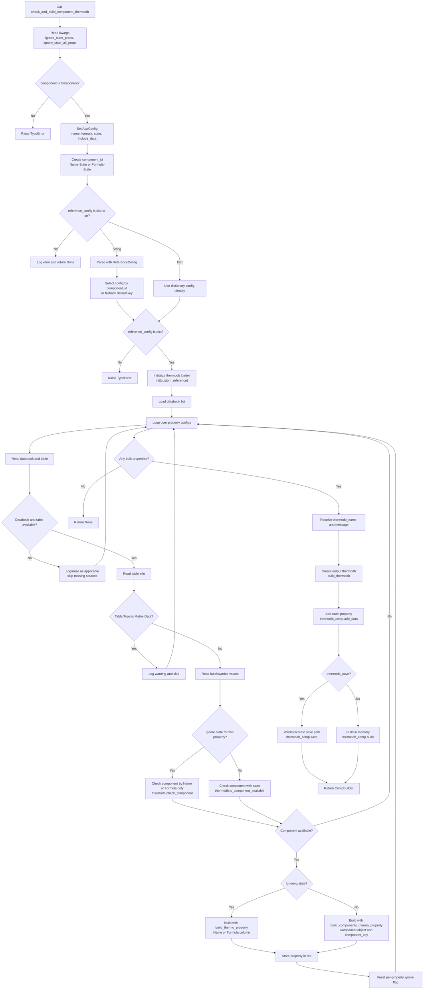

# `check_and_build_component_thermodb`

`check_and_build_component_thermodb` builds a single-component thermodynamic database after checking that the requested component is available in each configured source table. Unlike `build_component_thermodb`, this method receives a `Component` object and can match by both component identity and state.

The method supports two state-aware component keys:

- `Name-State`: uses `component.name` and `component.state`.
- `Formula-State`: uses `component.formula` and `component.state`.

It returns a `CompBuilder` when at least one property is built. It returns `None` when the input config is invalid or no configured property can be built.

## Main Inputs

| Argument | Purpose |
| --- | --- |
| `component` | `Component` model containing `name`, `formula`, and `state`. |
| `reference_config` | Property-to-source mapping as a dictionary, `ComponentConfig` mapping, or YAML/string config. |
| `custom_reference` | Optional reference source passed to `init(custom_reference=...)`. |
| `component_key` | Selects state-aware matching mode: `Name-State` or `Formula-State`. |
| `thermodb_name` | Optional output thermodb name. Defaults to the generated component ID. |
| `message` | Optional thermodb description. Defaults to a generated property list message. |
| `reference_config_default_check` | Allows fallback to default config keys such as `ALL` when a string config has no exact component ID match. |
| `thermodb_save` | Saves the built thermodb to disk when `True`; otherwise builds it in memory. |
| `thermodb_save_path` | Optional directory used when saving. |
| `verbose` | Enables detailed log messages and elapsed-time logging. |
| `include_data` | Sets global build configuration for whether source data is included. |
| `ignore_state_props` | Keyword argument list of labels/symbols whose state should be ignored. |
| `ignore_state_all_props` | Keyword argument that ignores state for every configured property. |

## Component ID

The method first creates a component ID from the `Component` object and `component_key`:

```python
CO2_component = Component(
    name='carbon dioxide',
    formula='CO2',
    state='g'
)
```

For this component:

| `component_key` | Generated `component_id` |
| --- | --- |
| `Name-State` | `carbon dioxide-g` |
| `Formula-State` | `CO2-g` |

This `component_id` is used to select the correct section when `reference_config` is supplied as a string.

## Reference Config

`reference_config` is the build recipe. It defines which thermodynamic properties should be included and where each property should be read from.

Each property entry must define:

- `databook`: source databook name.
- `table`: source table name.

It can also define:

- `label` or `symbol`: a single source label.
- `labels` or `symbols`: multiple source labels.

In this method, `label`, `symbol`, `labels`, and `symbols` are important for `ignore_state_props`. The method checks those label values against `ignore_state_props` to decide whether state should be ignored for that configured property.

### Dictionary Form

When `reference_config` is already a dictionary, the method loops over it directly.

```python
reference_config = {
    'heat-capacity': {
        'databook': 'CUSTOM-REF-1',
        'table': 'Ideal-Gas-Molar-Heat-Capacity',
        'symbol': 'Cp_IG',
    },
    'vapor-pressure': {
        'databook': 'CUSTOM-REF-1',
        'table': 'vapor-pressure',
        'symbol': 'VaPr',
    },
    'general': {
        'databook': 'CUSTOM-REF-1',
        'table': 'general-data',
        'symbols': {
            'Pc': 'Pc',
            'Tc': 'Tc',
            'AcFa': 'AcFa',
        },
    },
}
```

The top-level keys, such as `heat-capacity`, `vapor-pressure`, and `general`, become the property names in the returned `CompBuilder`.

### String/YAML Form

When `reference_config` is a string, the method parses it with `ReferenceConfig().set_reference_config(...)`, then extracts the section matching the generated `component_id`.

```yaml
ALL:
  heat-capacity:
    databook: CUSTOM-REF-1
    table: Ideal-Gas-Molar-Heat-Capacity
    symbol: Cp_IG
CO2-g:
  vapor-pressure:
    databook: CUSTOM-REF-1
    table: vapor-pressure
    symbol: VaPr
carbon dioxide-g:
  general:
    databook: CUSTOM-REF-1
    table: general-data
    symbols:
      Pc: Pc
      Tc: Tc
```

Lookup is case-insensitive. If no exact component ID section is found and `reference_config_default_check=True`, the method falls back to a default section such as `ALL`. If no matching or default section exists, the build fails.

## State Checking

By default, this method checks both component identity and state:

- `Formula-State` checks `Formula` and `State`.
- `Name-State` checks `Name` and `State`.

For normal state-aware checking, it calls:

```python
thermodb.is_component_available(
    component=component,
    databook=databook_,
    table=table_,
    component_key=component_key,
    res_format='dict'
)
```

If the component is available, it builds the property with:

```python
thermodb.build_components_thermo_property(
    components=[component],
    databook=databook_,
    table=table_,
    component_key=component_key
)
```

## Ignoring State

Some properties may not be state-specific in a reference table. Vapor pressure is a common example: the table may identify `CO2` without a `g`, `l`, or other state suffix. In that case, strict `Formula-State` or `Name-State` matching may fail.

This method supports two ways to ignore state.

### Ignore Selected Properties

Use `ignore_state_props` to ignore state only for properties whose `label`, `symbol`, `labels`, or `symbols` values match the list.

```python
thermodb_component = ptdb.check_and_build_component_thermodb(
    component=CO2_component,
    reference_config=reference_config,
    custom_reference=ref,
    component_key='Formula-State',
    ignore_state_props=['VaPr'],
)
```

With this config:

```yaml
vapor-pressure:
  databook: CUSTOM-REF-1
  table: vapor-pressure
  symbol: VaPr
```

`VaPr` matches `ignore_state_props`, so the method checks and builds vapor pressure using only:

- `Formula` when `component_key='Formula-State'`
- `Name` when `component_key='Name-State'`

### Ignore All Properties

Use `ignore_state_all_props=True` to ignore state for every configured property.

```python
thermodb_component = ptdb.check_and_build_component_thermodb(
    component=CO2_component,
    reference_config=reference_config,
    custom_reference=ref,
    component_key='Name-State',
    ignore_state_all_props=True,
)
```

If `ignore_state_props` is not empty, it takes priority and `ignore_state_all_props` is disabled.

## Returned Object

The method returns `Optional[CompBuilder]`.

When successful, the returned `CompBuilder` can be used like this:

```python
general = thermodb_component.select('general')
mw = thermodb_component.retrieve('general | MW', message='molecular weight')

cp = thermodb_component.select_function('heat-capacity')
cp_value = cp.cal(T=295.15, message='heat capacity result')
```

The method returns `None` when no properties are successfully built. This can happen when:

- the reference config is not a dictionary or string,
- databooks or tables are missing,
- the component is unavailable in all selected tables,
- the selected tables are not valid single-component sources,
- all property builds fail.

Matrix-data tables are skipped because this method is for single-component thermodb builds.

## Processing Flow

1. Read keyword options: `ignore_state_props` and `ignore_state_all_props`.
2. Validate the `Component` input.
3. Store `AppConfig` with `include_data`, build type, component name, formula, and state.
4. Build `component_id` from `component_key`.
5. Parse and select `reference_config` when it is supplied as a string.
6. Initialize the thermodb loader with `init(custom_reference=custom_reference)`.
7. Load available databooks.
8. Loop over each configured property.
9. Validate databook and table availability.
10. Skip matrix-data tables.
11. Read labels/symbols and decide whether to ignore state for this property.
12. Check component availability.
13. Build the property object.
14. Return `None` if no properties were built.
15. Create the output thermodb with `build_thermodb`.
16. Add built properties to the output thermodb.
17. Save or build the thermodb.
18. Return the `CompBuilder`.

## Diagram



## Example From `check and build component thermodb-1.py`

```python
CO2_component = Component(
    name='carbon dioxide',
    formula='CO2',
    state='g'
)

thermodb_component_1: Optional[CompBuilder] = ptdb.check_and_build_component_thermodb(
    component=CO2_component,
    reference_config=reference_config,
    custom_reference=ref,
    component_key='Formula-State'
)

if not thermodb_component_1:
    raise ValueError("ThermoDB component not built")
```

This call builds a thermodb for `CO2-g`. With `component_key='Formula-State'`, the method first looks for a `CO2-g` section when `reference_config` is a string. Then it checks each selected table using the component formula and state.

## Important Notes

- The returned object is a `CompBuilder`, not a `ComponentThermoDB` wrapper.
- The method returns `None` when no property is built.
- The method skips `Matrix-Data` tables because they are not single-component property tables.
- `ignore_state_props` compares against configured label/symbol values such as `VaPr`, not necessarily the top-level property key.
- If `ignore_state_props` is supplied, it overrides `ignore_state_all_props`.
- The default `thermodb_name` and default message use the generated `component_id`.
