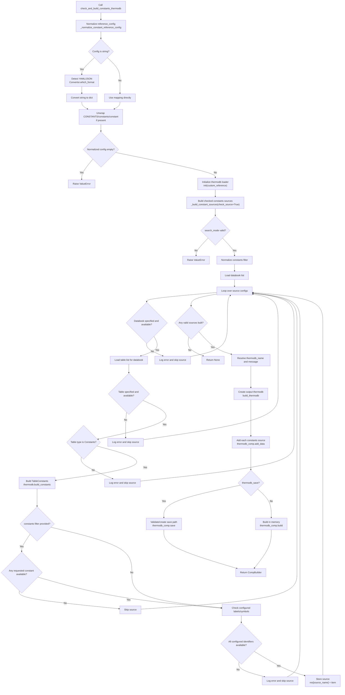

# `check_and_build_constants_thermodb`

`check_and_build_constants_thermodb` validates and builds a thermodb containing table-wide constants. It accepts an explicit constants `reference_config`, checks each configured source more strictly than `build_constants_thermodb`, builds valid constants tables as `TableConstants` objects, and stores them in a returned `CompBuilder`.

This method is useful when the constants config may come from a mapper, generated reference content, or user input and you want the builder to reject invalid constants sources before adding them to the thermodb.

## Main Inputs

| Argument | Purpose |
| --- | --- |
| `reference_config` | Constants source mapping as a dictionary, YAML string, or JSON string. |
| `custom_reference` | Optional custom reference source passed to `init(custom_reference=...)`. |
| `constants` | Optional constant name or list of constant names/symbols that must exist in a source. |
| `search_mode` | Search mode for `constants`: `NAME`, `SYMBOL`, or `BOTH`. |
| `thermodb_name` | Optional output thermodb name. Defaults to `constants`. |
| `message` | Optional thermodb description. Defaults to a generated source-list message. |
| `reference_config_default_check` | Kept for API parity; constants configs are treated as direct source configs. |
| `thermodb_save` | Saves the built thermodb to disk when `True`; otherwise builds it in memory. |
| `thermodb_save_path` | Optional directory used when saving. |
| `verbose` | Enables detailed validation/build logging and elapsed-time logging. |

## Reference Config

`reference_config` is the constants build recipe. Each top-level key becomes the constants source name in the returned `CompBuilder`, and each source points to one constants table.

Each source must define:

- `databook`: databook name registered in the initialized reference.
- `table`: table name inside that databook.

Each source may also define:

- `mode`: usually `CONSTANTS`.
- `label` or `symbol`: one configured constant identifier.
- `labels` or `symbols`: multiple configured constant identifiers.

Unlike `build_constants_thermodb`, this checked builder validates configured labels/symbols when they are present. The helper extracts both keys and values from `labels`/`symbols` dictionaries, then checks that all extracted identifiers are available in the built `TableConstants` source.

```python
reference_config = {
    'custom-1': {
        'databook': 'CUSTOM-REF-1',
        'table': 'Custom-Constants',
        'mode': 'CONSTANTS',
        'labels': {
            'Universal Gas Constant': 'R',
            'Constant1': 'C1',
            'enthalpy of reaction': 'dH_rxn',
            'gibbs energy of reaction': 'dG_rxn',
        },
    },
    'custom-2': {
        'databook': 'CUSTOM-REF-1',
        'table': 'Custom-Constants-2',
        'mode': 'CONSTANTS',
        'labels': {
            'Universal Gas Constant': 'R',
            'enthalpy of reaction': 'dG_rxn',
        },
    },
}
```

With this config, successful sources are added to the returned thermodb as `custom-1` and `custom-2`.

## String Configs

`reference_config` may be a YAML or JSON string. It is normalized with `_normalize_constant_reference_config(...)`.

String configs can define sources directly:

```yaml
custom-1:
  databook: CUSTOM-REF-1
  table: Custom-Constants
  mode: CONSTANTS
  labels:
    Universal Gas Constant: R
    enthalpy of reaction: dH_rxn
```

Or wrapped under one of these keys:

- `CONSTANTS`
- `constants`
- `constant`

```yaml
CONSTANTS:
  custom-1:
    databook: CUSTOM-REF-1
    table: Custom-Constants
    mode: CONSTANTS
```

After normalization, the method always works with:

```python
{
    source_name: {
        'databook': databook_name,
        'table': table_name,
        ...
    }
}
```

## Validation Behavior

The method delegates constants source validation and construction to `_build_constant_sources(...)` with `check_source=True`.

For each configured source, it checks:

1. `search_mode` is one of `NAME`, `SYMBOL`, or `BOTH`.
2. `databook` is specified.
3. The databook is available.
4. `table` is specified.
5. The table is available in the databook.
6. The table has type `Constants`.
7. The table can be built with `thermodb.build_constants(...)`.
8. If `constants` is provided, at least one requested constant exists in the source.
9. If config labels/symbols are provided, all configured identifiers exist in the source.

Sources that fail these checks are skipped. If every source is skipped, the method returns `None`.

## Constants Filter

The optional `constants` argument restricts which sources are accepted. It can be:

- `None`: build all valid constants sources.
- `str`: require one constant name or symbol.
- `list[str]`: require any one of the requested names or symbols.

`search_mode` controls how requested constants are matched:

| `search_mode` | Meaning |
| --- | --- |
| `NAME` | Search by constant name. |
| `SYMBOL` | Search by constant symbol. |
| `BOTH` | Search by either name or symbol. |

Example:

```python
constants_thermodb = ptdb.check_and_build_constants_thermodb(
    reference_config=reference_config,
    custom_reference=custom_reference,
    constants=['R', 'dH_rxn'],
    search_mode='BOTH',
)
```

In this case, a source is kept if it contains at least one requested constant.

## Returned Object

The method returns `Optional[CompBuilder]`.

When successful, the returned `CompBuilder` contains one or more `TableConstants` sources:

```python
constants_thermodb = ptdb.check_and_build_constants_thermodb(
    reference_config=reference_config,
    custom_reference=custom_reference,
    thermodb_name='constants',
)
```

Constants can be inspected and accessed through `CompBuilder` helpers:

```python
constants_sources = constants_thermodb.check_constants()

custom_1 = constants_thermodb.select_constant('custom-1')
R = custom_1.get_constant('R', message='gas constant')

R_again = constants_thermodb.retrieve(
    'custom-1 | R',
    message='gas constant'
)
```

The source name before the pipe, such as `custom-1`, comes from the top-level `reference_config` key. The constant identifier after the pipe, such as `R`, comes from the constants table content.

## Processing Flow

1. Optionally start verbose timing/logging.
2. Normalize `reference_config` with `_normalize_constant_reference_config(...)`.
3. Initialize the thermodb loader with `init(custom_reference=custom_reference)`.
4. Build and validate constants sources with `_build_constant_sources(..., check_source=True)`.
5. Return `None` if no valid constants sources were built.
6. Resolve `thermodb_name` and `message`.
7. Create the output thermodb with `build_thermodb(...)`.
8. Add each validated `TableConstants` source with `add_data(...)`.
9. Save the thermodb when `thermodb_save=True`; otherwise call `build()`.
10. Return the built `CompBuilder`.

## Diagram



## Example From `check-and-build-constant-thermodb-1.py`

```python
constants_thermodb: Optional[CompBuilder] = check_and_build_constants_thermodb(
    reference_config=reference_config_selected,
    custom_reference=custom_reference,
    thermodb_name='constants',
    thermodb_save=True,
    thermodb_save_path=db_path,
)

if constants_thermodb is None:
    raise ValueError("Constants ThermoDB build failed.")
```

After building, the example checks the returned constants sources:

```python
constants_sources = constants_thermodb.check_constants()

for source_name, source in constants_sources.items():
    if not isinstance(source, TableConstants):
        raise TypeError(
            f"Constants source '{source_name}' is not an instance of TableConstants."
        )
    print(source.data_structure())
```

## Difference From `build_constants_thermodb`

`build_constants_thermodb` checks that databooks and tables exist, then builds each constants table.

`check_and_build_constants_thermodb` adds stricter validation:

- checks the table type is `Constants`,
- can require specific constants through `constants`,
- validates configured `label`, `symbol`, `labels`, and `symbols` identifiers,
- skips sources that fail any of those checks.

Use `check_and_build_constants_thermodb` when the config should be verified before the thermodb is created.

## Important Notes

- The returned object is a `CompBuilder`, not a `ConstantsThermoDB` wrapper.
- Each top-level config key becomes a constants source name.
- Each accepted source is stored as a `TableConstants` object.
- Configured `labels`/`symbols` are validation hints, not a request to include only those constants.
- The method returns `None` when no valid constants source is built.
- The default thermodb name is `constants`.
